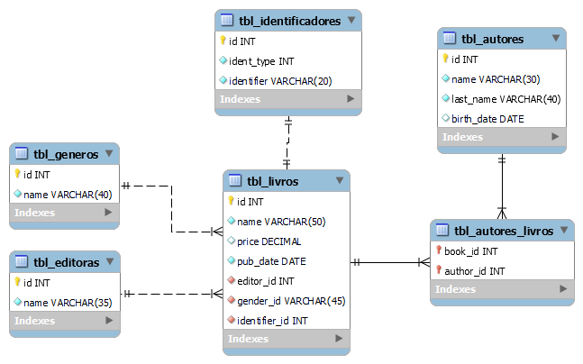
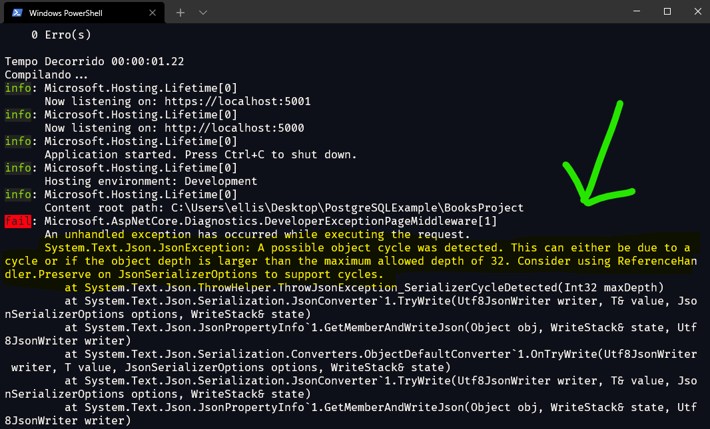

# EntityFramework com .NET 5

Criador por Ellison W. M. Guimarães.

LinkedIn: https://www.linkedin.com/in/ellisonguimaraes/

E-mail: [ellison.guimaraes@gmail.com](mailto:ellison.guimaraes@gmail.com)

Nesse modulo iremos trabalhar com o ORM EntityFramework, usando .NET5 e o banco de dados PostgreSQL. O EF é um framework ORM (*Object Relational Mapping*)que permite que façamos um mapeamento dos elementos de nossa base de dados para os elementos de nossa aplicação orientada a objetos.


## 1. Criando o Banco de Dados

Nessa aplicação assumimos que o banco já exista mas ==não== utilizaremos a abordagem *database first* (engenharia reversa do banco), neste exemplos iremos mapear manualmente os campos e as configurações para atender ao banco. Vejamos o modelo de dados: 



O banco denominado `BookDb` utilizado na aplicação tem o seguinte SQL(DDL):

```plsql
CREATE TABLE tbl_identificadores (
	id SERIAL CONSTRAINT pk_id_identificadores PRIMARY KEY,
	ident_type integer NOT NULL,
	identifier varchar(20) NOT NULL,
	UNIQUE(identifier)
);

CREATE TABLE tbl_editoras (
	id SERIAL CONSTRAINT pk_id_editor PRIMARY KEY,
	name varchar(35) UNIQUE NOT NULL
);

CREATE TABLE tbl_generos (
	id SERIAL CONSTRAINT pk_id_gender PRIMARY KEY,
	name varchar(40) NOT NULL,
	UNIQUE(name)
);

CREATE TABLE tbl_autores (
	id SERIAL CONSTRAINT pk_id_author PRIMARY KEY,
	name varchar(30) NOT NULL, 
	last_name varchar(40) NOT NULL,
	birth_date date
);

CREATE TABLE tbl_livros (
	id SERIAL CONSTRAINT pk_id_livro PRIMARY KEY,
	name varchar(50) NOT NULL,
	price money,
	pub_date date NOT NULL,
 	editor_id integer NOT NULL,
 	gender_id integer NOT NULL,
 	identifier_id integer NOT NULL,
	UNIQUE(identifier_id),
	FOREIGN KEY (editor_id) REFERENCES tbl_editoras (id) ON DELETE CASCADE,
	FOREIGN KEY (gender_id) REFERENCES tbl_generos (id) ON DELETE CASCADE,
	FOREIGN KEY (identifier_id) REFERENCES tbl_identificadores (id) ON DELETE CASCADE
);

CREATE TABLE tbl_autores_livros (
	book_id integer NOT NULL,
	author_id integer NOT NULL,
	PRIMARY KEY (book_id, author_id),
	FOREIGN KEY (book_id) REFERENCES tbl_livros (id) ON DELETE CASCADE,
	FOREIGN KEY (author_id) REFERENCES tbl_autores (id) ON DELETE CASCADE
);
```


## 2. Criando o Projeto e Instalando suas Dependências

O projeto é um simples projeto *webapi*:

```C#
dotnet new webapi -o BooksProject
```

E foram necessárias as dependências do ***Entity Framework Core*** e do driver do **PostgreSQL**, além disso, foi necessário o **NewtonsoftJson**:

- A dependência do provedor do **PostgreSQL** já traz consigo também as ferramentas do **EntityFrameworkCore**, logo somente é necessário instala-lo:

    ```C#
    dotnet add package Npgsql.EntityFrameworkCore.PostgreSQL
    ```

- A dependência **NewstonsoftJson** foi necessária no momento de utilização dos `.Include()` no `DbSet` para realizar consulta. Como se trata de um objeto dentro do outro (quando há relacionamento), na serialização é necessário que o `Json` também retorne esse outro objeto, e por este motivo, é necessário o uso desta biblioteca.

    ```C#
    dotnet add package Microsoft.AspNetCore.Mvc.NewtonsoftJson
    ```

    > Além de instalar o pacote é necessário permitir no `Startup` esse tipo de interação. Veremos essa configuração no tópico de configurações.


## 3. Fazendo as Configurações Necessárias

### 3.1. Configurações da ConnectionStrings e Entity Framework

Antes de tudo é necessário configurar a *string* de conexão (`ConnectionStrings`) e configurar o *EntityFramework* na classe `Startup`. Para isso, inserimos a *string* de conexão no `appsettings.json`:

```json
{
	"Logging": {
		"LogLevel": {
			"Default": "Information",
			"Microsoft": "Warning",
            "Microsoft.Hosting.Lifetime": "Information"
    	}
  	},
    
  	"AllowedHosts": "*",
    
  	"ConnectionStrings": {
    	"PostgreSQLConnectionString" :
        			"Host=localhost;Database=BookDb;Username=postgres;Password=admin"
  	}
}
```

E na classe `Startup` no método `ConfigureServices` configuramos o *EntityFramework* usando o PostgreSQL como banco de dados:

```C#
services.AddDbContext<ApplicationDbContext>(options => 
{
	options.UseNpgsql(Configuration.GetConnectionString("PostgreSQLConnectionString"));
});
```

Informamos entre `<>` o nosso contexto (que iremos criar a seguir) e a `options` usamos o método `.UseNpgsql`, que veio do pacote ***Npgsql***, passando a *string* de conexão através do comando `Configuration.GetConnectionString("PostgreSQLConnectionString")`.

> Se quiser utilizar outro banco de dados as únicas alterações que serão feitas será:
>
> - O formato da *string* de conexão varia para cada banco, logo, possa ser necessário mudar;
> - O pacote driver/provedor utilizado, que neste projeto usamos o `Npgsql.EntityFrameworkCore.PostgreSQL`;
> - Será outro método usado no lugar de `UseNpgsql` na classe `Startup` no método `ConfigureServices`: cada provedor tem sua forma diferente de configurar.


### 3.2. Configurações da Serialização com Include

Nas consultas ao `DbSet`, quando utilizamos o método `Include` para incluir uma nova entidade para retorno, criamos uma espécie de "Objeto dentro de Objeto", logo, o `Json` precisa na sua serialização acessar essa outra entidade dentro do objeto para poder serializar também. Para que isso seja possível, é necessário a biblioteca do `NewtonsoftJson` e a seguinte configuração na classe `Startup` no método `ConfigureServices`:

```C#
services.AddControllers()
        .AddNewtonsoftJson(options => 
					options.SerializerSettings.ReferenceLoopHandling = 															Newtonsoft.Json.ReferenceLoopHandling.Ignore);
```

No próprio `services.AddController()` fazer a adição do método `AddNewtonsoftJson`: observe que dentro do método usamos `SerializerSettings.ReferenceLoopHandling` que exatamente a configuração do *looping* de serialização.

> Caso essa configuração não seja feita, ao usar `Include` na consulta irá retornar um erro como na imagem abaixo:
>
> 


## 4. Criando as Entidades, Mapeando e Criando o Contexto (`DbContext`)

A primeira parte foi feita (Configurações), agora precisamos criar as entidades do sistema, mapear elas em relação ao banco de dados e criar o nosso contexto `Context`. 

### 4.1. Criando as Entidades

Baseando em nosso modelo de banco de dados foram criadas as entidades do sistema. Usamos uma classe base `BaseClass` com o atributo `Id` para não ter que replicar em todos as entidades.

```C#
namespace BooksProject.Models
{
    public abstract class BaseClass
    {
        public int Id { get; set; }
    }
}
```

`Author`:

```C#
using System;
using System.Collections.Generic;

namespace BooksProject.Models
{
    public class Author : BaseClass
    {
        public string Name { get; set; }
        public string LastName { get; set; }
        public DateTime BirthDate { get; set; }

        // Relationship
        public virtual List<AuthorBook> AuthorBooks { get; set; }
    }
}
```

`Gender`:

```C#
using System.Collections.Generic;

namespace BooksProject.Models
{
    public class Gender : BaseClass
    {
        public string Name { get; set; }

        // Relationship
        public virtual List<Book> Books { get; set; }
    }
}
```

`Editor`:

```C#
using System.Collections.Generic;

namespace BooksProject.Models
{
    public class Editor : BaseClass
    {
        public string Name { get; set; }

        // Relationship
        public virtual List<Book> Books { get; set; }
    }
}
```

`Book`:

```C#
using System;
using System.Collections.Generic;

namespace BooksProject.Models
{
    public class Book : BaseClass
    {
        public string Name { get; set; }
        public decimal Price { get; set; }
        public DateTime PubDate { get; set; }

        // Relationship
        public int EditorId { get; set; }
        public virtual Editor Editor { get; set; }

        public int GenderId { get; set; }
        public virtual Gender Gender { get; set; }

        public int IdentifierId { get; set; }
        public virtual Identifier Identifier { get; set; }

        public virtual List<AuthorBook> AuthorBooks { get; set; }
    }
}
```

`Identifier`:

```C#
using BooksProject.Enums;

namespace BooksProject.Models
{
    public class Identifier : BaseClass
    {
        public BookTypeIdentifier IdentifierType { get; set; }
        public string IdentifierNumber { get; set; }

        // Relationship
        public virtual Book Book { get; set; }
    }
}
```

E por último a classe intermediária `AuthorBook` da relação *many-to-many* entre `Author` e `Book`:

```C#
namespace BooksProject.Models
{
    public class AuthorBook
    {
        public int AuthorId { get; set; }
        public virtual Author Author { get; set; }
        
        public int BookId { get; set; }
        public virtual Book Book { get; set; }
    }
}
```

> Observe que esta última, a `AuthorBook`, não herda de classe base `BaseClass`.

É possível observar que na classe `Identifier` o atributo `IdentifierType` é do tipo `enum BookTypeIdentifier`:

```C#
namespace BooksProject.Enums
{
    public enum BookTypeIdentifier : byte
    {
        ISBN = 1,
        ISSN = 2,
        DOI = 3
    }
}
```

> O *Entity Framework* converte automaticamente em inteiro ao chegar no banco de dados e ao retornar converte no tipo enumerado.

Os atributos de relacionamento (*relationship*) conversaremos mais adiante.

### 4.2. Criando o Contexto (`DbContext`)

Agora precisamos criar o nosso contexto, ou seja, uma classe que herde de `DbContext`. É criado no projeto o `ApplicationDbContext`:

```C#
using BooksProject.Map;
using Microsoft.EntityFrameworkCore;

namespace BooksProject.Models
{
    public class ApplicationDbContext : DbContext
    {
        public DbSet<Editor> Editoras { get; set; }
        public DbSet<Author> Autores { get; set; }
        public DbSet<Gender> Generos { get; set; }
        public DbSet<Book> Livros { get; set; }
        public DbSet<Identifier> Identificadores { get; set; }
        public DbSet<AuthorBook> AutorLivro { get; set; }

        public ApplicationDbContext(DbContextOptions<ApplicationDbContext> options) 
            : base(options)
        {}
    
        protected override void OnModelCreating(ModelBuilder modelBuilder)
        {
            // Mapping
            new AuthorEntityTypeConfiguration()
                							.Configure(modelBuilder.Entity<Author>());
            new EditorEntityTypeConfiguration()
                							.Configure(modelBuilder.Entity<Editor>());
            new GenderEntityTypeConfiguration()
                							.Configure(modelBuilder.Entity<Gender>());
            new BookEntityTypeConfiguration().Configure(modelBuilder.Entity<Book>());
            new IdentifierEntityTypeConfiguration()
                						.Configure(modelBuilder.Entity<Identifier>());
            new AuthorBookEntityTypeConfiguration()
                						.Configure(modelBuilder.Entity<AuthorBook>());
        }
    }
}
```

Inserimos as propriedades `DbSet` referente a cada uma das nossas entidades e criamos o construtor recebendo `DbContextOptions<ApplicationDbContext>` e repassando para a classe base.

O método `OnModelCreating` usamos para mapear nossas entidade através de ***Fluent* API**. Iremos explicar melhor no tópico a seguir.


### 4.3. Mapeamento das Entidades

No *Entity Framework* existem três tipo de mapeamento, são eles:

- Automático: o próprio framework correlaciona a tabela com os atributos da classe. (não recomendada);

- Usando `DataAnnotations`: para exemplificar, iremos mapear a `BaseClass` e `Author`:

    ```C#
    using System.ComponentModel.DataAnnotations;
    
    namespace BooksProject.Models
    {
        public abstract class BaseClass
        {
            [Key]
            public int Id { get; set; }
        }
    }
    ```

    ```C#
    using System.ComponentModel.DataAnnotations.Schema;
    using System;
    using System.ComponentModel.DataAnnotations;
    
    namespace BooksProject.Models
    {
        [Table("tbl_autores")]
        public class Author : BaseClass
        {
            [Column("name")]
            [Required]
            [MaxLength(30)]
            public string Name { get; set; }
    
            [Column("last_name")]
            [Required]
            [MaxLength(40)]
            public string LastName { get; set; }
    
            [Column("birth_date")]
            [Required]
            public DateTime BirthDate { get; set; }
    
            // Relationship
            public virtual Book Book { get; set; }
        }
    }
    ```

    > Essa forma é muito usada, porém, prefere-se a Fluent API. É possível ler sobre `DataAnnotations` no site: [https://www.entityframeworktutorial.net/code-first/dataannotation-in-code-first.aspx](https://www.entityframeworktutorial.net/code-first/dataannotation-in-code-first.aspx)

- Usando ***Fluent API*** que é o mais recomendado.


#### Mapeamento com FLUENT API

O mapeamento com *FluentAPI* é feita através do método `OnModelCreating`. Através do `modelBuilder` podemos fazer o mapeamento das entidades e suas propriedades. Veja a seguir um exemplo do mapeamento da classe 

```C#
protected override void OnModelCreating(ModelBuilder modelBuilder)
{
	modelBuilder.Entity<Author>(entity => {
        // Entity Mapping
        entity.ToTable("tbl_autores");
        entity.HasKey(a => a.Id);
        
        // Property Mapping
        entity.Property(a => a.Id).HasColumnName("id");
        entity.Property(a =>
                        	a.Name).HasColumnName("name").HasMaxLength(30).IsRequired();
        entity.Property(a =>
                   a.LastName).HasColumnName("last_name").HasMaxLength(40).IsRequired();
        entity.Property(a => a.BirthDate).HasColumnName("birth_date").IsRequired();
    }); 
}
```

Através do `modelBuilder` conseguimos configurar uma entidade específica através do `modelBuilder.Entity<Entidade>()`. Através do parâmetro podemos configurar o mapeamento.

Dividimos o mapeamento em:

- Mapeamento de Entidade (*Entity Mapping*): é quando o mapeamento refere-se a **tabela** e não a suas colunas.
- Mapeamento de Propriedades (*Property Mapping*): é quando o mapeamento refere-se as **colunas** e não a tabela como um todo.

Vejam algum dos métodos para a configuração de entidade (*Entity Mapping*):

| CONFIGURATION             | DESCRIÇÃO                                                    |
| ------------------------- | ------------------------------------------------------------ |
| `HasIndex()`              | Configures the index property for the entity type.           |
| `HasKey()`                | Configures the primary key property for the entity type.     |
| `HasMany()`               | Configures the Many relationship for one-to-many or many-to-many relationships. |
| `HasOptional()`           | Configures an optional relationship which will create a nullable foreign key in the database. |
| `HasRequired()`           | Configures the required relationship which will create a non-nullable foreign key column in the database. |
| `Ignore()`                | Configures that the class or property should not be mapped to a table or column. |
| `Map()`                   | Allows advanced configuration related to how the entity is mapped to the database schema. |
| `MapToStoredProcedures()` | Configures the entity type to use INSERT, UPDATE and DELETE stored procedures. |
| `ToTable()`               | Configures the table name for the entity.                    |

E algumas métodos de configuração para propriedades (*Property Mapping*):

| CONFIGURATION                  | DESCRIÇÃO                                                    |
| ------------------------------ | ------------------------------------------------------------ |
| `IsRequired()`                 | Configures the property to be required on SaveChanges().     |
| `HasColumnAnnotation()`        | Sets an annotation in the model for the database column used to store the property. |
| `IsConcurrencyToken()`         | Configures the property to be used as an optimistic concurrency token. |
| `IsOptional()`                 | Configures the property to be optional which will create a nullable column in the database. |
| `HasParameterName()`           | Configures the name of the parameter used in the stored procedure for the property. |
| `HasDatabaseGeneratedOption()` | Configures how the value will be generated for the corresponding column in the database e.g. computed, identity or none. |
| `HasColumnOrder()`             | Configures the order of the database column used to store the property. |
| `HasColumnType()`              | Configures the data type of the corresponding column of a property in the database. |
| `HasColumnName()`              | Configures the corresponding column name of a property in the database. |

> Para mais informações o site [https://www.entityframeworktutorial.net/code-first/fluent-api-in-code-first.aspx](https://www.entityframeworktutorial.net/code-first/fluent-api-in-code-first.aspx).

##### 

##### EntityTypeConfiguration

Para reduzir o tamanho do `OnModelCreating` do contexto, recomenda-se criar uma classe de mapeamento para cada uma das entidades, e é o que faremos neste projeto. Essa classe de mapeamento herda a interface `IEntityTypeConfiguration<Entidade>` que recebe uma entidade. Ela força a implementar o método de `public void Configure(EntityTypeBuilder<Entidade> builder)`. Veremos como ficou nossas classes de mapeamento:

`AuthorEntityTypeConfiguration.cs`:

```C#
using BooksProject.Models;
using Microsoft.EntityFrameworkCore;
using Microsoft.EntityFrameworkCore.Metadata.Builders;

namespace BooksProject.Map
{
    public class AuthorEntityTypeConfiguration : IEntityTypeConfiguration<Author>
    {
        public void Configure(EntityTypeBuilder<Author> builder)
        {
            // Entity Configuration
            builder.ToTable("tbl_autores");
            builder.HasKey(a => a.Id);
            
            // Property Configuration
            builder.Property(a => a.Id).HasColumnName("id");
            builder.Property(a => a.Name)
                			.HasColumnName("name").HasMaxLength(30).IsRequired();
            builder.Property(a => a.LastName)
                			.HasColumnName("last_name").HasMaxLength(40).IsRequired();
            builder.Property(a => a.BirthDate).HasColumnName("birth_date").IsRequired();
        }
    }
}
```

`EditorEntityTypeConfiguration.cs`:

```C#
using BooksProject.Models;
using Microsoft.EntityFrameworkCore;
using Microsoft.EntityFrameworkCore.Metadata.Builders;

namespace BooksProject.Map
{
    public class EditorEntityTypeConfiguration : IEntityTypeConfiguration<Editor>
    {
        public void Configure(EntityTypeBuilder<Editor> builder)
        {
            // Entity Configuration
            builder.ToTable("tbl_editoras");
            builder.HasKey(e => e.Id);

            // Property Configuration
            builder.Property(e => e.Id).HasColumnName("id");
            builder.Property(e => e.Name)
                .HasColumnName("name").HasMaxLength(35).IsRequired();
        }
    }
}
```

`GenderEntityTypeConfiguration.cs`:

```C#
using BooksProject.Models;
using Microsoft.EntityFrameworkCore;
using Microsoft.EntityFrameworkCore.Metadata.Builders;

namespace BooksProject.Map
{
    public class GenderEntityTypeConfiguration : IEntityTypeConfiguration<Gender>
    {
        public void Configure(EntityTypeBuilder<Gender> builder)
        {
            // Entity Configuration
            builder.ToTable("tbl_generos");
            builder.HasKey(g => g.Id);

            // Property Configuration
            builder.Property(g => g.Id).HasColumnName("id");
            builder.Property(g => g.Name)
                .HasColumnName("name").HasMaxLength(40).IsRequired();
        }
    }
}
```

`BookEntityTypeConfiguration.cs`:

```C#
using BooksProject.Models;
using Microsoft.EntityFrameworkCore;
using Microsoft.EntityFrameworkCore.Metadata.Builders;

namespace BooksProject.Map
{
    public class BookEntityTypeConfiguration : IEntityTypeConfiguration<Book>
    {
        public void Configure(EntityTypeBuilder<Book> builder)
        {
            // Entity Configuration
            builder.ToTable("tbl_livros");
            builder.HasKey(b => b.Id);

            // Property Configuration
            builder.Property(b => b.Id).HasColumnName("id");

            builder.Property(b => b.Name)
                .HasColumnName("name").HasMaxLength(50).IsRequired();
            builder.Property(b => b.Price).HasColumnName("price").HasPrecision(17, 2);
            builder.Property(b => b.PubDate).HasColumnName("pub_date").IsRequired();

            builder.Property(b => b.IdentifierId)
                .HasColumnName("identifier_id").IsRequired();
            builder.Property(b => b.EditorId).HasColumnName("editor_id").IsRequired();
            builder.Property(b => b.GenderId).HasColumnName("gender_id").IsRequired();

            // Relationship
            builder.HasOne<Editor>(b => b.Editor)
                .WithMany(e => e.Books)
                .HasForeignKey(b => b.EditorId);

            builder.HasOne<Gender>(b => b.Gender)
                .WithMany(g => g.Books)
                .HasForeignKey(b => b.GenderId);
        }
    }
}
```

`IdentifierEntityTypeConfiguration.cs`:

```C#
using BooksProject.Models;
using Microsoft.EntityFrameworkCore;
using Microsoft.EntityFrameworkCore.Metadata.Builders;

namespace BooksProject.Map
{
    public class IdentifierEntityTypeConfiguration :IEntityTypeConfiguration<Identifier>
    {
        public void Configure(EntityTypeBuilder<Identifier> builder)
        {
            // Entity Configuration
            builder.ToTable("tbl_identificadores");
            builder.HasKey(i => i.Id);

            // Property Configuration
            builder.Property(i => i.Id).HasColumnName("id").IsRequired();
            builder.Property(i => i.IdentifierType)
                .HasColumnName("ident_type").HasPrecision(1).IsRequired();
            builder.Property(i => i.IdentifierNumber)
                .HasColumnName("identifier").IsRequired();

            // Relationship
            builder.HasOne<Book>(i => i.Book)
                .WithOne(b => b.Identifier)
                .HasForeignKey<Book>(b => b.IdentifierId);
        }
    }
}
```

`AuthorBookEntityTypeConfiguration.cs`:

```C#
using BooksProject.Models;
using Microsoft.EntityFrameworkCore;
using Microsoft.EntityFrameworkCore.Metadata.Builders;

namespace BooksProject.Map
{
    public class AuthorBookEntityTypeConfiguration :IEntityTypeConfiguration<AuthorBook>
    {
        public void Configure(EntityTypeBuilder<AuthorBook> builder)
        {
            // Entity Configuration
            builder.ToTable("tbl_autores_livros");
            builder.HasKey(ab => new { ab.BookId, ab.AuthorId });

            // Property Configuration
            builder.Property(ab => ab.BookId).HasColumnName("book_id").IsRequired();
            builder.Property(ab => ab.AuthorId).HasColumnName("author_id").IsRequired();

            // Relationship
            builder.HasOne<Book>(ab => ab.Book)
                .WithMany(b => b.AuthorBooks)
                .HasForeignKey(ab => ab.BookId);

            builder.HasOne<Author>(ab => ab.Author)
                .WithMany(b => b.AuthorBooks)
                .HasForeignKey(ab => ab.AuthorId);
        }
    }
}
```


Para que essas configurações sejam aplicadas é necessário invocar o método `Configure` no método `OnModelCreating` de `ApplicationDbContext`:

```C#
protected override void OnModelCreating(ModelBuilder modelBuilder)
{
    // Mapping
    new AuthorEntityTypeConfiguration().Configure(modelBuilder.Entity<Author>());
    new EditorEntityTypeConfiguration().Configure(modelBuilder.Entity<Editor>());
    new GenderEntityTypeConfiguration().Configure(modelBuilder.Entity<Gender>());
    new BookEntityTypeConfiguration().Configure(modelBuilder.Entity<Book>());
    new IdentifierEntityTypeConfiguration()
        .Configure(modelBuilder.Entity<Identifier>());
    new AuthorBookEntityTypeConfiguration()
        .Configure(modelBuilder.Entity<AuthorBook>());
}
```

> Documentação do `EntityTypeConfiguration`: [https://docs.microsoft.com/pt-br/ef/core/modeling/](https://docs.microsoft.com/pt-br/ef/core/modeling/). 


#### Mapeamento do Relacionamento (Chaves Estrangeiras)

##### Um para Um (*One-to-one*)

Neste exemplo, temos somente uma relação *One-to-one* que é a relação entre `Book`(`tbl_livros`) e `Identifier`(`tbl_identificadores`). Nesse exemplo a chave primária fica em `Book`, a `identifier_id`. 

Para essa relação é necessário inserir uma propriedade para cada um dos lados, ou seja, a classe `Book` necessita ter um `Identifier` e a classe `Identifier` precisa de uma propriedade `Book`.

Logo, a classe `Book` tem as propriedades:

```C#
public int IdentifierId { get; set; }
public virtual Identifier Identifier { get; set; }
```

Como a tabela `tbl_livros` possui o `identifier_id` para o `tbl_identificadores`, também precisa de uma propriedade do tipo inteiro para recebe-lo, que nesse caso, é a propriedade `IdentifierId`.

E a classe `Identifier` a propriedade:

```C#
public virtual Book Book { get; set; }
```

A relação desse exemplo foi mapeada na classe `IdentifierEntityTypeConfiguration` do  `Identifier` e ficou da seguinte forma:

```C#
// Relationship
builder.HasOne<Book>(i => i.Book)
    .WithOne(b => b.Identifier)
    .HasForeignKey<Book>(b => b.IdentifierId);
```

Na linha:

- 2, lê-se: "`Identifier` (`builder`) tem um (*has one*) `Book`" e é necessário identificar o atributo de `Identifier` que é o do tipo `Book`;
- 3, lê-se: "Tem um (`WithOne`)" e é necessário identificar o atributo de `Book` que é do tipo `Identifier`;
- 4, lê-se: "Tem uma chave estrangeira (*HasForeignKey*) em `Book` (entre `<>`)" e é necessário identificar o atributo de `Book` que deverá guardar o `id` de `Identifier`.

> O mapeamento poderia ser feito também na classe de mapeamento de `Book`, a classe `BookEntityTypeConfiguration`:
>
> ```C#
> // Relationship
> builder.HasOne<Identifier>(b => b.Identifier)
>     .WithOne(i => i.Book)
>     .HasForeignKey<Book>(b => b.IdentifierId);
> ```

> Para ler mais sobre o mapeamento *one-to-one* acessar o site [https://www.entityframeworktutorial.net/efcore/configure-one-to-one-relationship-using-fluent-api-in-ef-core.aspx](https://www.entityframeworktutorial.net/efcore/configure-one-to-one-relationship-using-fluent-api-in-ef-core.aspx)


##### Um para Muitos (*One-to-many*)

Neste exemplo, temos duas relações *One-to-Many* que é a relação entre:

- `Book`(`tbl_livros`) e `Gender`(`tbl_generos`);
- `Book`(`tbl_livros`) e `Editor`(`tbl_editoras`);

Quando se trata de relacionamento *One-to-Many* sabemos que a chave primária sempre fica ao lado do **MUITOS**, que nesse caso, as chaves estrangeiras ficam em `Book`, a `GenderId`(`gender_id`) e `EditorId`(`editor_id`). Do lado `Book` precisamos da referência para o lado **UM**, com isso criamos propriedades parecidas com a criada no tópico anterior:

```C#
public int EditorId { get; set; }
public virtual Editor Editor { get; set; }

public int GenderId { get; set; }
public virtual Gender Gender { get; set; }
```

Já no lado do **MUITOS**, ou seja, na classe `Gender` e `Editor` precisamos inserir a propriedade que é uma **lista** (em ambas as classes):

```C#
public virtual List<Book> Books { get; set; }
```

Agora que os atributos estão corretamente inseridos, precisamos fazer o mapeamento. O mapeamento da relação *One-to-Many* normalmente é feita na classe de mapeamento do lado **MUITOS**, que nesse caso é o `Book`. A seguir iremos mapear a relação na classe `BookEntityTypeConfiguration` tanto de `Gender` quanto de `Editor`:

```C#
// Relationship
builder.HasOne<Editor>(b => b.Editor)
    .WithMany(e => e.Books)
    .HasForeignKey(b => b.EditorId);

builder.HasOne<Gender>(b => b.Gender)
    .WithMany(g => g.Books)
    .HasForeignKey(b => b.GenderId);
```

Na linha: 

- 2, lê-se: "`Book` (`builder`) tem um (*has one*) `Editor`" sendo necessário inserir o atributo de `Book` que é do tipo `Editor`;
- 3, lê-se: "com muitos (*WithMany*)" sendo necessário informar o atributo de `Editor` que é uma lista de `Book`, ou seja, `Books`;
- 4, lê-se: "Tem uma chave estrangeira (*HasForeighKey*)" e devemos informar onde está o `id` para `Gender`;
- Repete-se para as linhas 6, 7 e 8.

> Para ler mais sobre o mapeamento *one-to-many* acessar o site [https://www.entityframeworktutorial.net/efcore/configure-one-to-many-relationship-using-fluent-api-in-ef-core.aspx](https://www.entityframeworktutorial.net/efcore/configure-one-to-many-relationship-using-fluent-api-in-ef-core.aspx)


##### Muitos para Muitos (*Many-to-many*)

Neste exemplo, temos somente uma relação *Many-to-Many* que é a relação entre `Book`(`tbl_livros`) e `Author`(`tbl_autores`). A relação entre elas é feita pela entidade `AuthorBook` (`tbl_autores_livros`). A configuração é feita fazendo a mesma relação *One-to-Many* para `Book` e `AuthorBook` e `Author` para `AuthorBook`.

Como `Book`(`tbl_livros`) e `Author`(`tbl_autores`) é o lado **UM**, necessitam de uma propriedade do tipo lista de `AuthorBook`:

```C#
public virtual List<AuthorBook> AuthorBooks { get; set; }
```

Já no lado **MUITOS**, além de guardar o `id` tanto de  `Book`(`BookId`) quanto de `Author`(`AuthorId`) a classe também precisa ter a referência de acesso, ou seja, uma propriedade do tipo `Book` e outra do tipo `Author`:

```C#
namespace BooksProject.Models
{
    public class AuthorBook
    {
        public int AuthorId { get; set; }
        public virtual Author Author { get; set; }
        
        public int BookId { get; set; }
        public virtual Book Book { get; set; }
    }
}
```

Agora é preciso somente fazer a relação, que como visto anteriormente no *One-to-many*, as relações são configuradas no lado **MUITOS**, ou seja, em `AuthorBookEntityTypeConfiguration`, na classe de mapeamento de `AuthorBook`:

```C#
// Relationship
builder.HasOne<Book>(ab => ab.Book)
    .WithMany(b => b.AuthorBooks)
    .HasForeignKey(ab => ab.BookId);

builder.HasOne<Author>(ab => ab.Author)
    .WithMany(b => b.AuthorBooks)
    .HasForeignKey(ab => ab.AuthorId);
```

> Caso não entenda essa parte, volte ao tópico *One-to-Many*.

> Para ler mais sobre o mapeamento *many-to-many* acessar o site [https://www.entityframeworktutorial.net/efcore/configure-many-to-many-relationship-in-ef-core.aspx](https://www.entityframeworktutorial.net/efcore/configure-many-to-many-relationship-in-ef-core.aspx)


## 5. Construção dos métodos CRUD: Persistindo, realizando consultas, atualizando e removendo dados.

O CRUD das tabelas são realizadas encima dos `DbSet` presentes no `ApplicationDbContext`, e são realizadas usando o **LINQ** do C#, seja através de *Query Syntax* ou *Method Syntax*. Neste projeto iremos utilizar o *Method Syntax*. 

Para melhor organização da arquitetura, iremos utilizar o Padrão Repositório (*Repository Pattern*). As classes de repositório serão utilizadas para fazer acesso ao banco, ou seja, ao `DbContext`. A pasta referente ao padrão conterá: 

- Uma pasta denominada **Interface** onde terá todas as interfaces dos respectivos repositórios, que nesse caso usamos somente o `IRepository`, que é uma interface genérica; 
- Classe de repositório genérica `GenericRepository`;
- Classes de repositório referente a cada uma das entidades. Elas em geral seguem o mesmo padrão. São elas:
    - `AuthorRepository`
    - `BookRepository`
    - `EditorRepository`
    - `GenderRepository`
    - `IdentifierRepository`

> **Aviso!**
>
> Neste projeto utilizamos paginação de dados ao invés de retornar todos os dados de uma tabela no banco. Para isso utilizamos a paginação feita em [https://github.com/ellisonguimaraes/](https://github.com/ellisonguimaraes/DOTNET5_PaginationData). Além disso também utilizamos o Padrão Repositório (*Repository Pattern*) que pode ser encontrado em: [https://github.com/ellisonguimaraes/DOTNET5_FluentValidation_RepositoryPattern_Mysql](https://github.com/ellisonguimaraes/DOTNET5_FluentValidation_RepositoryPattern_Mysql).
>
> Observe que nas classes de repositório não retornamos todos os dados no `Get` e sim de forma paginada `PagedList`. Para inserir a paginação criamos uma pasta `Models/Pagination` com duas classes:
>
> - `PagedList` que é a extensão de um `List` para suportar dados paginados:
>
>     ```C#
>     using System;
>     using System.Collections.Generic;
>     using System.Linq;
>     
>     namespace BooksProject.Models.Pagination
>     {
>         public class PagedList<T> : List<T>
>         {
>             public int CurrentPage { get; set; }
>             public int TotalPages { get; set; }
>             public int PageSize { get; set; }
>             public int TotalCount { get; set; }
>             public bool HasPrevious => CurrentPage > 1;
>             public bool HasNext => CurrentPage < TotalPages;        
>                   
>             public PagedList(IQueryable<T> source, 
>                              int pageNumber, int pageSize)
>             {
>                 TotalCount = source.Count();
>                 PageSize = pageSize;
>                 CurrentPage = pageNumber;
>                 TotalPages = (int)Math.Ceiling(TotalCount / (double)PageSize);
>     
>                 var items = source
>                     .Skip((this.CurrentPage - 1) * this.PageSize)
>                     .Take(this.PageSize)
>                     .ToList();
>     
>                 this.AddRange(items);
>             }
>         }
>     }
>     ```
>
> - A classe `PaginationParameters` que é o DTO contendo `PageNumber` (página requerida) e `PageSize` (quantidade de itens por página) recebido pelo *client*:
>
>     ```C#
>     namespace BooksProject.Models.Pagination
>     {
>         public class PaginationParameters
>         {
>             const int MAX_PAGE_SIZE = 50;
>             private int _pageSize = 10;
>     
>             public int PageNumber { get; set; } = 1;
>             public int PageSize {
>                 get => _pageSize;
>                 set => _pageSize = value > MAX_PAGE_SIZE ? MAX_PAGE_SIZE : value;
>             }
>     
>             public PaginationParameters() { }
>             
>             public PaginationParameters(int pageNumber, int pageSize)
>             {
>                 PageNumber = pageNumber;
>                 PageSize = pageSize;
>             }
>         }
>     }
>     ```


### 5.1. Construção do Padrão Repositório (*Repository Pattern*)

#### Interface do Repositório

Usamos somente uma interface para os repositórios, a `IRepository`:

```C#
using BooksProject.Models;
using BooksProject.Models.Pagination;

namespace BooksProject.Repositories.Interface
{
    public interface IRepository<TEntity> where TEntity : BaseClass
    {
        PagedList<TEntity> Get(PaginationParameters paginationParameters);
        TEntity GetById(int id);
        TEntity Create(TEntity item);
        TEntity Update(TEntity item);
        bool Delete(int id);
    }
}
```

Ela contém os principais métodos CRUD do banco de dados. É possível observar também o objeto retornado na assinatura do método `Get`, que é do tipo `PagedList` (tipo criado para paginação), e também o objeto recebido via parâmetro que também se trata dos parâmetros de paginação.


#### Repositório Genérico

O repositório genérico `GenericRepository` foi criado e pode ser utilizado para consultas simples de uma única tabela (sem *join*):

```C#
using System;
using System.Linq;
using BooksProject.Models;
using BooksProject.Models.Context;
using BooksProject.Models.Pagination;
using BooksProject.Repositories.Interface;
using Microsoft.EntityFrameworkCore;

namespace BooksProject.Repositories {
    
    public class GenericRepository<TEntity> : IRepository<TEntity> where TEntity : BaseClass
    {
        private readonly ApplicationDbContext _context;
        private readonly DbSet<TEntity> _dbSet;

        public GenericRepository(ApplicationDbContext context) {
            _context = context;
            _dbSet = _context.Set<TEntity>();
        }

        public PagedList<TEntity> Get(PaginationParameters paginationParameters) =>
            new PagedList<TEntity>(_dbSet.OrderBy(i => i.Id), 
                                    paginationParameters.PageNumber,
                                    paginationParameters.PageSize);

        public TEntity GetById(int id)
            => _dbSet
                .Where(i => i.Id == id)
                .SingleOrDefault();
        
        public TEntity Create(TEntity item) {
            try {
                _dbSet.Add(item);
                _context.SaveChanges();
                
            } catch(Exception) {
                throw;
            }

            return item;
        }

        public TEntity Update(TEntity item) {
            TEntity getItem = _dbSet.Where(i => i.Id == item.Id).SingleOrDefault();

            if (getItem != null) {
                try {
                    _context.Entry(getItem).CurrentValues.SetValues(item);
                    _context.SaveChanges();
                    
                } catch(Exception) {
                    throw;
                }
            }
            
            return item;
        }

        public bool Delete(int id) {
            TEntity getItem = _dbSet.Where(i => i.Id == id).SingleOrDefault();

            if (getItem != null) {
                try {
                    _dbSet.Remove(getItem);
                    _context.SaveChanges();
                    return true;
                    
                } catch(Exception) {
                    throw;
                }
            }
            
            return false;
        }
    }
}
```

Podemos fazer algumas observações:

- Essa classe implementa a interface `IRepository` e é do tipo genérica `TEntity` onde é definido a regra `where` no qual indica que `TEntity` será somente classes que herdam de `BaseClass`;
- Recebe em seu construtor o `ApplicationDbContext`, armazena ao atributo local `_context` e já obtém o `DbSet` referente ao tipo `TEntity` e armazena ao atributo local `_dbSet`;
- O restante dos métodos falaremos em tópicos abaixo.


#### Repositórios Específicos

Quando se trata de tabelas com relacionamentos, precisamos incluir (`Include`) alguns dados específicos na *query*, e por este motivo criamos repositórios específicos para cada um. Todos esses repositórios específicos tem a mesma estrutura, e para demonstração, iremos utilizar o maior deles, o `BookRepository`:

```C#
using System;
using System.Linq;
using BooksProject.Models;
using BooksProject.Models.Context;
using BooksProject.Models.Pagination;
using BooksProject.Repositories.Interface;
using Microsoft.EntityFrameworkCore;

namespace BooksProject.Repositories
{
    public class BookRepository : IRepository<Book> 
    {
        private readonly ApplicationDbContext _context;

        public BookRepository(ApplicationDbContext context)
        {
            _context = context;
        }
        
        public PagedList<Book> Get(PaginationParameters paginationParameters)
            => new PagedList<Book>(_context.Livros
                                   .Include(b => b.Editor)
                                   .Include(b => b.Gender)
                                   .Include(b => b.Identifier)
                                   .Include(b => b.AuthorBooks)
                                   .OrderBy(b => b.Id)
                                   .Select(b => new Book(){
                                       Id = b.Id,
                                       Name = b.Name,
                                       Price = b.Price,
                                       PubDate = b.PubDate,
                                       EditorId = b.EditorId,
                                       GenderId = b.GenderId,
                                       IdentifierId = b.IdentifierId,
                                       Editor = b.Editor,
                                       Gender = b.Gender,
                                       Identifier = b.Identifier,
                                       AuthorBooks = b.AuthorBooks
                                          	.Select(ab => new AuthorBook{
                                           		Author = ab.Author,
                                           		AuthorId = ab.AuthorId
                                       }).ToList()
                                   }),
                                   paginationParameters.PageNumber,
                                   paginationParameters.PageSize);

        public Book GetById(int id)
            => _context.Livros
                .Include(b => b.Editor)
                .Include(b => b.Gender)
                .Include(b => b.Identifier)
                .Include(b => b.AuthorBooks).ThenInclude(ab => ab.Author)
                .Where(b => b.Id == id)
                .SingleOrDefault();

        public Book Create(Book item) {
            try {
                _context.Livros.Add(item);
                _context.SaveChanges();
                
            } catch(Exception) {
                throw;
            }

            return item;
        }

        public Book Update(Book item) {
            var getItem = _context.Livros
                				.Where(b => b.Id == item.Id).SingleOrDefault();

            if (getItem != null) {
                try {
                    _context.Entry(getItem).CurrentValues.SetValues(item);
                    _context.SaveChanges();
                    
                } catch(Exception) {
                    throw;
                }
            }

            return item;
        }
        
        public bool Delete(int id) {
            var getItem = _context.Livros
                				.Where(b => b.Id == id).SingleOrDefault();

            if (getItem != null) {
                try {
                    _context.Livros.Remove(getItem);
                    _context.SaveChanges();
                    return true;
                    
                } catch(Exception) {
                    throw;
                }
            }

            return false;
        }
    }
}
```

Podemos observar através desse código:

- Diferentemente do `GenericRepository`, não há a necessidade de ter uma instância própria do `DbSet`;
- As consultas são realizadas pelos métodos `Get` e `GetById`;
- Os métodos:
    - `Create` é utilizado para **inserir** dados ao banco;
    - `Update` é utilizado para **atualizar** um dado no banco;
    - `Delete` é utilizado para **excluir** um dado no banco.


### 5.2. Entendendo as consultas (Read)

As consultas são realizadas através dos métodos `Get` e `GetById` dos repositórios e trata-se de consultas **LINQ**. De forma geral as consultas são realizadas através do **LINQ** presente no C#, porém, há algumas extensões do **LINQ** no pacote do *EntityFramework* usadas especificamente para as consultas a banco. 

Algumas operações do LINQ são:

- **Filtering**: `Where`, `OfType`;
- **Sorting**: `OrderBy`, `OrderByDescending`, `ThenBy`, `ThenByDescending`, `Reverse`;
- **Set**: `Distinct`, `Except`, `Intersect`, `Union`;
- **Quantification**: `All`, `Any`, `Contains`;
- **Projection**: `Select`, `SelectMany`;
- **Partition**: `Skip`, `Take`;
- **Join**: `Join`, `GroupJoin`;
- **Grouping**: `GroupBy`;
- **Generational**: `Empty`;
- **Equality**: `SequenceEquals`;
- **Element**: `ElementAt`, `First`, `FirstOrDefault`, `Last`, `LastOrDefault`, `Single`, `SingleOrDefault`;
- **Conversions**: `AsEnumerable`, `AsQueryable`;
- **Concatenation**: `Concat`;
- **Aggregation**: `Aggregate, Average, Count, LongCount, Max, Min, Sum`;

Algumas operações do LINQ estendida pelo pacote *EntityFramework* são:

- **Include**: `Include(x => x.Attribute)`. Essa operação é utilizada para incluir dados de outra tabela na qual tem relacionamento.

    A tabela `Book` contém referência para `Editor`, `Gender`, `Identifier` e `AuthorBook`, com isso, é possível observar no tópico 5.3 que o repositório `BookRepository` contém o método `Include` incluindo os dados de cada um dos objetos que tem relação. Se o `Include` não for colocado, a tabela é retornada sem os dados dos seus relacionamentos.

- **ThenInclude**: `ThenInclude(x => x.Attribute)`. Essa operação é utilizada em conjunto com a anterior para incluir outras tabelas a partir da segunda. Ela é comumente utilizada para consultas no relacionamento *many-to-many*


#### Usando `Include` e `ThenInclude` nas consultas: relacionamento *Many-to-Many*

O relacionamento *Many-to-Many* tem algumas particularidades quanto a sua consulta. Observe por exemplo no relacionamento entre `Book` e `Author`, onde temos `AuthorBook` como sua tabela intermediária.

Na classe de repositório, quando utilizamos `.Include(b => b.AuthorBooks)` nas consultas somente é retornado os dados/atributos de `AuthorBooks`, porém, o que nos interessa é o `Author` contido nela, que nesse caso, não aparecerá os dados. 

Para que esses dados possam aparecer, é possível com as seguintes opções:

- Utilizando `Select`: para exemplificar, iremos utilizar o método `Get` paginado de `BookRepository`:

    ```C#
    public PagedList<Book> Get(PaginationParameters paginationParameters)
    	=> new PagedList<Book>(_context.Livros
                        .Include(b => b.Editor)
                        .Include(b => b.Gender)
                        .Include(b => b.Identifier)
                        .Include(b => b.AuthorBooks)
                        .OrderBy(b => b.Id)
                        .Select(b => new Book(){
                            Id = b.Id,
                            Name = b.Name,
                            Price = b.Price,
                            PubDate = b.PubDate,
                            EditorId = b.EditorId,
                            GenderId = b.GenderId,
                            IdentifierId = b.IdentifierId,
                            Editor = b.Editor,
                            Gender = b.Gender,
                            Identifier = b.Identifier,
                            AuthorBooks = b.AuthorBooks.Select(ab => new AuthorBook{
                                Author = ab.Author,
                                AuthorId = ab.AuthorId
                            }).ToList()
                        }),
    		paginationParameters.PageNumber,
    		paginationParameters.PageSize);
    ```

    -  É utilizado o `.Select`, onde para cada objeto `b` retornamos um novo `Book` (`new Book()`) atribuindo os valores de `b` ao novo objeto.
    - Ao chegar na atribuição de `AuthorBooks` (objeto com relação *many-to-many*) fazemos um novo `Select`, onde para cada `ab` de `AuthorBooks`, retornamos um novo objeto `AuthorBook` atribuindo os dados de `ab` para esse novo objeto.
    - Esse *looping* acontece até que esteja na tabela de interesse. Podemos ver exemplos disso nos métodos `Get` paginado de `Book` e `Author`.

- Utilizando `Include` e `ThenInclude`: para exemplificar, iremos utilizar o método `GetById` de `AuthorRepository`:

    ```C#
    public Author GetById(int id)
        => _context.Autores
        .Include(a => a.AuthorBooks).ThenInclude(ab => ab.Book)
        .Include(a => a.AuthorBooks).ThenInclude(ab => ab.Book.Editor)
        .Include(a => a.AuthorBooks).ThenInclude(ab => ab.Book.Gender)
        .Include(a => a.AuthorBooks).ThenInclude(ab => ab.Book.Identifier)
        .Where(a => a.Id == id)
        .SingleOrDefault();
    ```

    - Através da tabela `Author` precisamos acessar `Book` do atributo `AuthorBooks`, para isso, usamos o `Include` para `AuthorBooks` e em seguida usamos o `ThenInclude` para a partir de `AuthorBooks` incluir `Book`.
    - Porém, sabemos que `Book` tem outros relacionamentos ao qual desejamos incluir também. Para que isso seja feito, é preciso inserir quantos `Include` forem necessários com o `ThenInclude` acessando cada um desses relacionamentos. 
    - Veja por exemplo na linha 4 do código acima que ele inclui `ab.Book.Editor`, e assim por diante. 

Incluindo uma tabela via `Include` e `ThenInclude` é realmente muito mais fácil, porém, a utilização do `Select` pode ser uma boa escolha quando desejamos fazer a projeção dos dados/obter somente o necessário. 

> É possível ler mais sobre o uso na documentação oficial: [https://docs.microsoft.com/pt-br/ef/core/querying/related-data/eager](https://docs.microsoft.com/pt-br/ef/core/querying/related-data/eager)


### 5.3. Create, Update e Delete

Falaremos nesse tópico sobre cada um dos métodos de Create, Update e Delete.

> Os métodos `create`, `update` e `delete` seguem o padrão estabelecido no projeto sobre *Fluent Validation* e *Repository Pattern* no **GitHub**: [https://github.com/ellisonguimaraes/DOTNET5_FluentValidation_RepositoryPattern_Mysql](https://github.com/ellisonguimaraes/DOTNET5_FluentValidation_RepositoryPattern_Mysql)


#### Create

O método `Create` tem a seguinte forma:

```C#
public Book Create(Book item) {
    try {
        _context.Livros.Add(item);
        _context.SaveChanges();

    } catch(Exception) {
        throw;
    }

    return item;
}
```

O método recebe um objeto entidade `Book` via parâmetro. Entre blocos `try~catch` usamos o contexto `_context`, acessando a tabela referente a `Book` (`DbSet Livros`) e adicionamos o item recebido via parâmetro.

Logo após adicionarmos precisamos salvar as mudanças no banco com o comando `.SaveChanges()`. Se nenhum problema ocorrer, o programa retornará esse item recebido.

> Automaticamente ao salvarmos no banco de dados, o objeto `item` já será referenciado ao objeto do banco e retornará com um `id`.


#### Update

O método `Update` tem a seguinte forma:

```C#
public Book Update(Book item) {
    var getItem = _context.Livros.Where(b => b.Id == item.Id).SingleOrDefault();

    if (getItem != null) {
        try {
            _context.Entry(getItem).CurrentValues.SetValues(item);
            _context.SaveChanges();

        } catch(Exception) {
            throw;
        }
    }

    return item;
}
```

Antes de atualizar, precisamos saber se esse item realmente existe no banco de dados, e para isso precisamos acessar o banco (linha 2) buscando através do `id` do item recebido.

Antes de fazer a atualização é necessário verificar se a consulta ao banco retornou realmente um dado (linha 4), verificando se `getItem` não é nulo. 

Se `getItem` não for nulo, através de um bloco `try~catch` fazemos as alterações. Usamos na linha 6 o comando `_context.Entry(getItem).CurrentValues.SetValues(item);` informando qual o item da tabela precisamos alterar (`getItem`) e iremos trocar os valores dele pelos valores de `item`. Finalmente precisamos salvar as mudanças.

Se tudo ocorrer bem, assim como no `Create`, `item` já retornará com as alterações feita na linha 6. 


#### Delete

O método `Delete` tem a seguinte forma:

```C#
public bool Delete(int id) {
    var getItem = _context.Livros.Where(b => b.Id == id).SingleOrDefault();

    if (getItem != null) {
        try {
            _context.Livros.Remove(getItem);
            _context.SaveChanges();
            return true;

        } catch(Exception) {
            throw;
        }
    }

    return false;
}
```

O método de `Delete` é semelhante ao método `Update`, seguindo o mesmo princípio de verificar pelo `id` se o dado existe no banco. É feita uma validação se o dado retornado é diferente de nulo e através do bloco `try~catch` fazemos a remoção com o comando `_context.Livros.Remove(getItem)` e salvamos as alterações no banco com `.SaveChanges()`.

A diferença desse método está no retorno, que quando ocorre com sucesso é retornado um `true`, se não um `false`. 


### 5.4. Injeção de Dependências (DI) referente aos repositórios

O projeto necessita das seguintes Injeções de Dependências (DI) configuradas ao método `ConfigureServices` da classe `Startup` para que os repositórios sejam acessados no programa:

```C#
// Dependency Injection (DI)
services.AddScoped(typeof(IRepository<>), typeof(GenericRepository<>));
services.AddScoped<IRepository<Book>, BookRepository>();
services.AddScoped<IRepository<Gender>, GenderRepository>();
services.AddScoped<IRepository<Editor>, EditorRepository>();
services.AddScoped<IRepository<Identifier>, IdentifierRepository>();
services.AddScoped<IRepository<Author>, AuthorRepository>();
```


Separar curso (titulação atual)

Ocupação Atual e Histórico

Link para LinkedIn

Cadastro mínimo de teacher e Student
